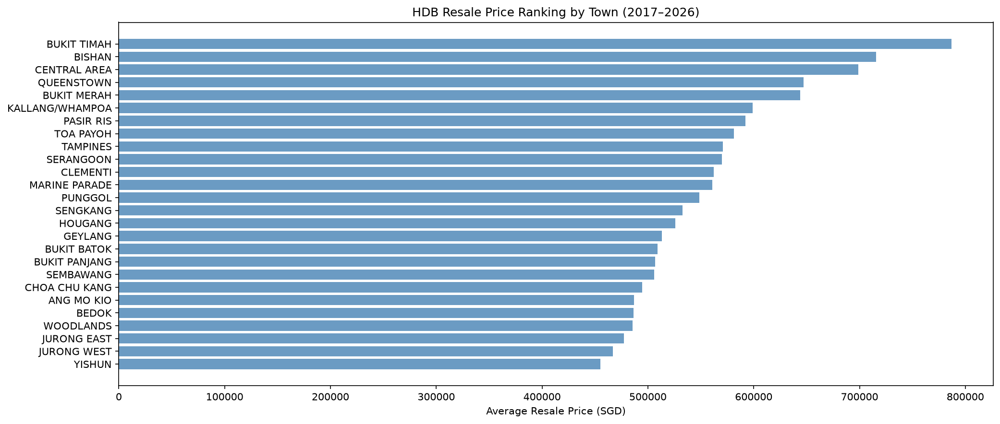
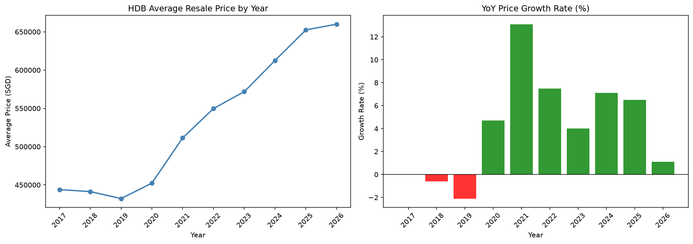
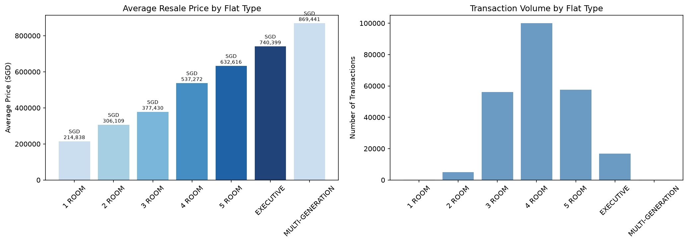
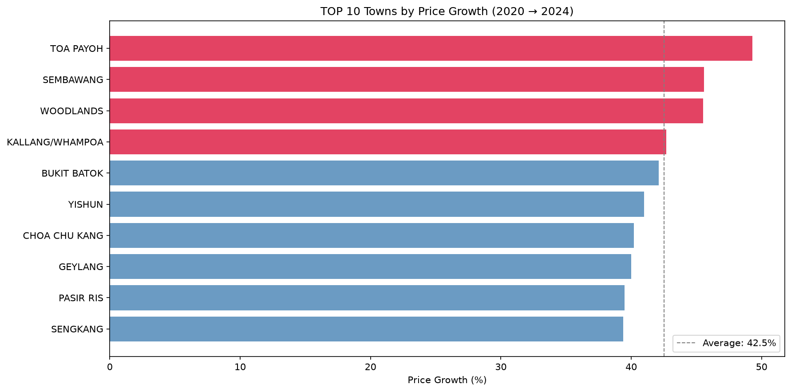
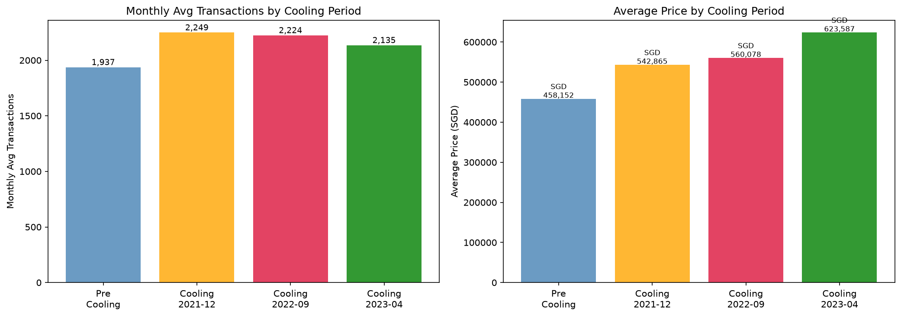

# Singapore HDB Resale Price — SQL Analysis
**Answering 5 real-world business questions using SQL on 235,468 HDB transactions**

## Overview
This project demonstrates SQL analytical skills by querying Singapore HDB resale transaction data (2017–2026) stored in SQLite. Each analysis answers a concrete business question using progressively advanced SQL techniques — from basic aggregations to window functions and CTEs.

## Dataset
- **Source**: [HDB Resale Flat Prices — data.gov.sg](https://data.gov.sg/datasets/d_8b84c4ee58e3cfc0ece0d773c8ca6abc/view)
- **Period**: January 2017 – July 2026
- **Size**: 235,468 transactions
- **Database**: SQLite (hdb.db)

## SQL Techniques Used
| Technique | Question |
|-----------|----------|
| GROUP BY + RANK() Window Function | Town price ranking |
| LAG() Window Function + CTE | YoY price growth rate |
| GROUP BY + Aggregations | Flat type price distribution |
| CTE + Self JOIN | Top 10 price growth towns |
| CASE WHEN + GROUP BY | Cooling measure period analysis |

## Business Questions & Key Findings

### Q1. Which towns have the highest average HDB resale prices?
- **Bukit Timah** tops at SGD 786,863 avg — but only 575 transactions (premium, scarce)
- **Yishun** is the most affordable at SGD 456,654
- Central and mature estates command significant premiums over new towns

### Q2. How have HDB prices grown year-over-year?
- 2018–2019: Price decline (-0.6%, -2.1%) from cooling measures
- 2021: Sharpest surge at **+13.1%** post-COVID demand explosion
- 2022–2025: Steady growth of +4~7% per year
- 2026: Growth slowing to +1.1%

### Q3. How do prices vary by flat type?
- 4 ROOM dominates with 99,998 transactions — Singapore's standard family flat
- MULTI-GENERATION averages SGD 869,441 but only 88 transactions
- Price range: SGD 214,838 (1 ROOM) → SGD 869,441 (MULTI-GENERATION)

### Q4. Which towns saw the biggest price surge from 2020 to 2024?
- **Toa Payoh** leads with +49.3% growth
- Sembawang (+45.6%) and Woodlands (+45.5%) follow — northern towns catching up
- All TOP 10 towns grew over +39%, reflecting Singapore-wide property boom

### Q5. How did cooling measures affect transaction volume and prices?
- Despite 3 rounds of cooling measures, **prices kept rising** (SGD 458k → SGD 624k)
- Transaction volume actually **increased** after cooling measures (1,937 → 2,249/month)
- Cooling measures slowed price growth but did not reverse it

## Results

## Tech Stack
- Python 3.12
- SQLite (via Python sqlite3 standard library)
- pandas (pd.read_sql for query execution)
- matplotlib

## Next Steps
- Add window function queries (NTILE, PERCENT_RANK) for price percentile analysis
- Geospatial analysis by postal district
- StrataScratch-style interview question solutions
